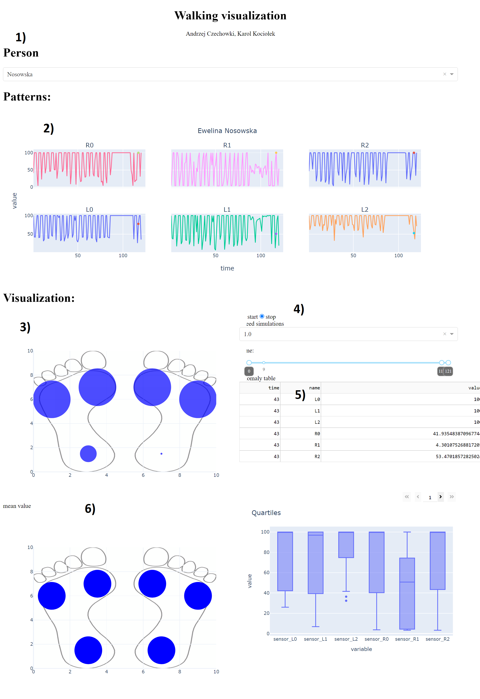

---
author:
- 'Karol Kociołek, Andrzej Czechowski'
date: '01.2022'
title: 'Final project 2020Z - User manual - Walking visualization'
---

\

Run app
=======

Run commands:

    export FLASK_APP=app_s
    flask run

And type in your browser : http://127.0.0.1:5000/dash/

User Manual
===========

1)Patient selection
-------------------

To select patient click on dropdown menu and select patient

2)Patterns recognition
----------------------

The graphs show the pressure at a given point in the foot over time. To
visualize desired trace on 3) graph hover over graph.

3)Animation graph
-----------------

Shows trace selected by 2) pattern menu or 3) animation menu. Presents 6
circle shape markers in pressure point on feet. Size of marker depends
on pressure value in that point. If in that trace anomaly is detected
marker will be red otherwise they are blue.

4)Animation menu
----------------

Menu allows to control visualization on 3) graph. It allows to start and
stop animation, choose animation speed. Slider allows to move over data
ans select range for 2) graph.

4)Anomalies table
-----------------

Table contains detected anomalies. To visualize anomaly it is necessary
to use slider from 5)animation menu and find matching trace with time
matching in the table.

6)Graphs
--------

Graphs show mean values and quartiles in point of feet in time.

Architecure
===========

app\_s.py
---------

Main program. Creates Flask server and dash app. Creates app layout.

create\_fig.py
--------------

Contains functions to create graphs

 live\_read\_data.py and read\_data
----------------------------------

Reads live data from API and saves it to sql database

prepared\_measurements.py
-------------------------

Reads data from sql and returns pandas dataframe.

Database
--------

We use sqlite3.
